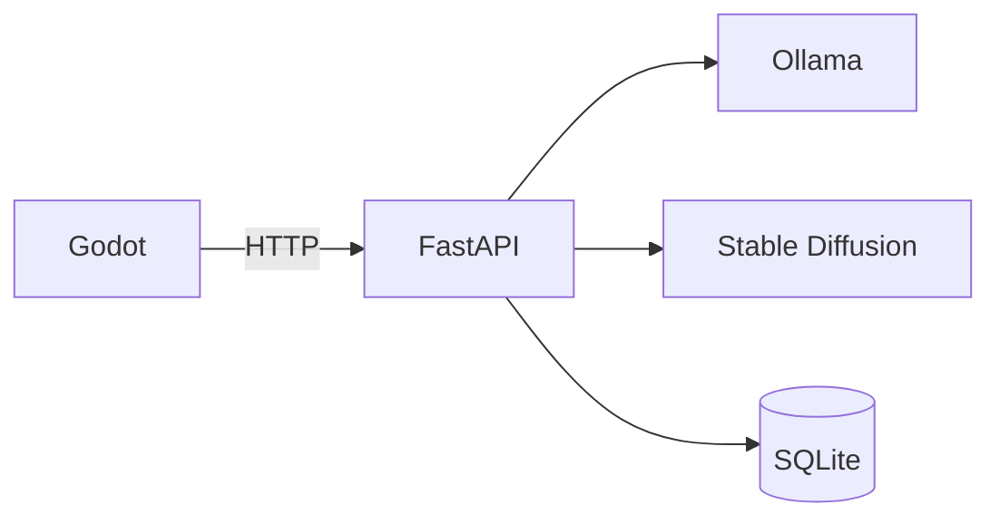

# 🤖 GodotAI

GodotAI combine Godot, FastAPI et Ollama pour expérimenter localement l'intelligence artificielle dans un mini-jeu. Tout fonctionne dans des conteneurs Docker pour une mise en route rapide.

👉 Consultez la [documentation complète](https://ezpk.github.io/GodotAI/) pour suivre le tutoriel de prise en main et découvrir les guides, la référence et les explications détaillées.

## Architecture rapide



Godot envoie les actions du joueur à FastAPI qui interroge Ollama pour le texte et
Stable Diffusion pour les images. Les données sont stockées dans SQLite.

## Lancer la stack

Toutes les dépendances, y compris FastAPI, tournent dans des conteneurs Docker.
Lancez-les en une seule commande :

```bash
make up
```

Une fois les services prêts, l'API FastAPI répond sur
`http://localhost:8000`. Elle relaye vos requêtes vers Ollama avec
`POST /txt` et vers Stable Diffusion avec `POST /img`.
