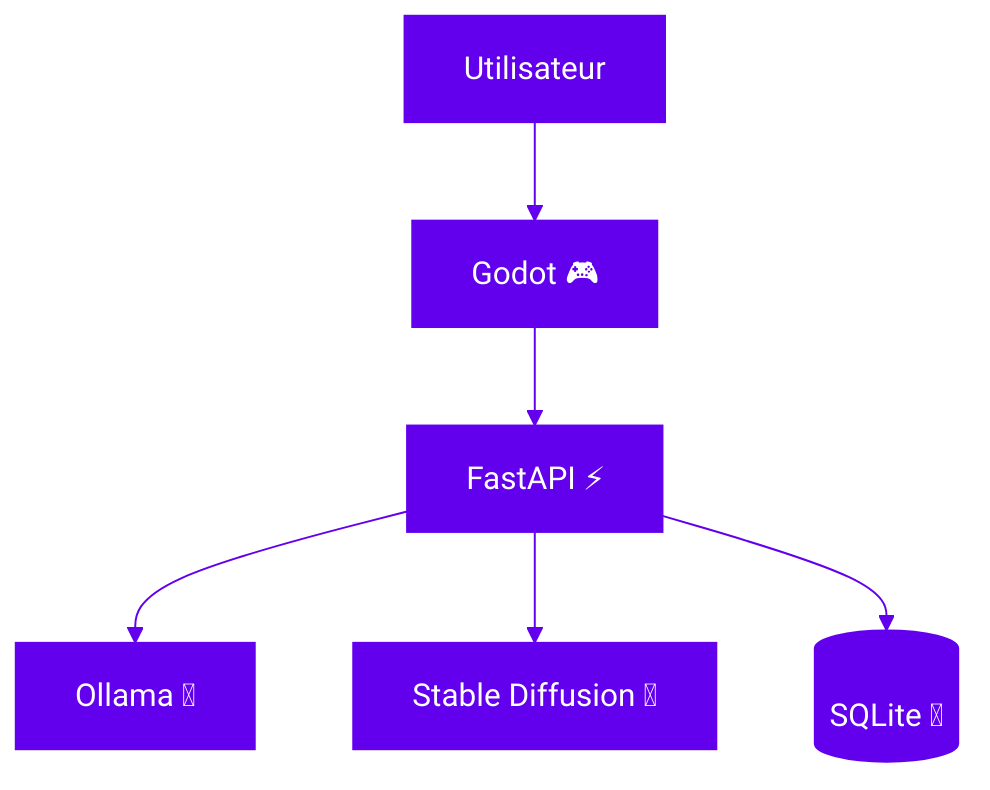

# 🧩 Comprendre la stack

Cette page présente brièvement l'architecture générale avant de détailler chaque composant.

Le diagramme ci-dessous est généré avec **Mermaid** :



## Rôle des composants
- **Godot 🎮** : le dossier `godot/` renferme les scènes et scripts du mini-jeu. La scène `scenes/Main.tscn` communique avec l'API via des nœuds `HTTPRequest`.
- **FastAPI ⚡** : le backend Python vit dans `backend/app`. Le module `backend_server.py` expose notamment la route `/generate-text` et enregistre les échanges dans `data/game.db` grâce à SQLAlchemy.
- **Ollama 🦙** : construit via `Dockerfile.ollama`, ce service télécharge le modèle indiqué par `OLLAMA_TEXT_MODEL` au démarrage grâce au script `entrypoint_ollama.sh`.
- **Stable Diffusion 🎨** : le service `stablediffusion` gère la génération d'images et conserve les fichiers dans les volumes `sd_models` et `sd_outputs`.
- **Docker Compose 🐳** : le fichier `docker-compose.yml` orchestre tous les conteneurs et le `Makefile` fournit les raccourcis `make up` et `make down`.
- **MkDocs 📚** : la documentation statique est générée depuis `docs/` à l'aide du fichier `mkdocs.yml`.

## Pages détaillées
- [⚡ FastAPI](fastapi.md)
- [🦙 Ollama](ollama.md)
- [🎨 Stable Diffusion](stable-diffusion.md)
- [🎮 Godot](godot.md)
- [🐳 Docker Compose](docker-compose.md)
- [📚 MkDocs](mkdocs.md)

Chaque page de la documentation renvoie vers le site officiel et le manuel de référence pour en apprendre davantage.

## Exemple d'appel API
```python
import requests

BASE_URL = "http://localhost:8000"
resp = requests.post(
    f"{BASE_URL}/generate-text",
    json={"session_id": 1, "action": "look around"},
)
print(resp.json())
```

## Voir aussi

- [Tutoriel de prise en main](../tutoriels/premiers-pas.md)
