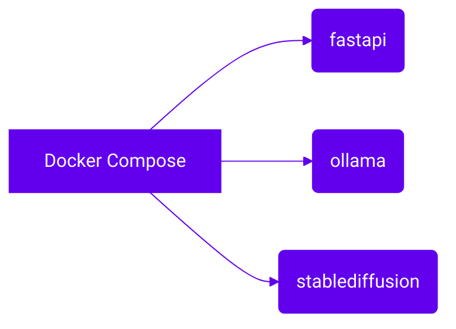

# 🐳 Docker Compose

Docker Compose est l'outil qui lance plusieurs conteneurs Docker en une seule commande.
Le fichier `docker-compose.yml` définit trois services : **fastapi**, **ollama** et **stablediffusion**.



Pour simplifier la vie du développeur, toutes les commandes utiles sont regroupées dans le `Makefile`.

Commandes utiles :
```bash
# Démarrer les services en arrière-plan
make up

# Arrêter l'ensemble
make down
```

## Voir aussi

- [Fichier `docker-compose.yml`](../reference/docker-compose-yml.md)
- [Makefile](../reference/makefile.md)

## Ressources
- [Site officiel](https://www.docker.com/)
- [Documentation](https://docs.docker.com/compose/)
