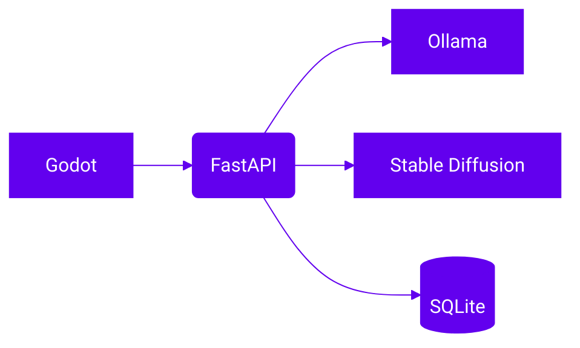

# ⚡ FastAPI

FastAPI est un framework Web moderne et asynchrone pour Python. Il s'appuie sur
Pydantic pour la validation des données et génère automatiquement une
documentation interactive.

Dans **GodotAI**, FastAPI sert de colonne vertébrale au backend : il expose les
routes appelées par Godot, dialogue avec Ollama pour produire du texte et
déclenche la génération d'images via Stable Diffusion. Il stocke aussi les
informations de partie dans SQLite.



## Exemple minimal
```python
from fastapi import FastAPI

app = FastAPI()

@app.get("/ping")
def ping():
    return {"message": "pong"}
```

## Voir aussi

- [Référence de l'API](../reference/api-backend.md)
- [Guide d'utilisation de l'API](../guides/utiliser-api.md)

## Ressources
- [Site officiel](https://fastapi.tiangolo.com/)
- [Documentation](https://fastapi.tiangolo.com/)
