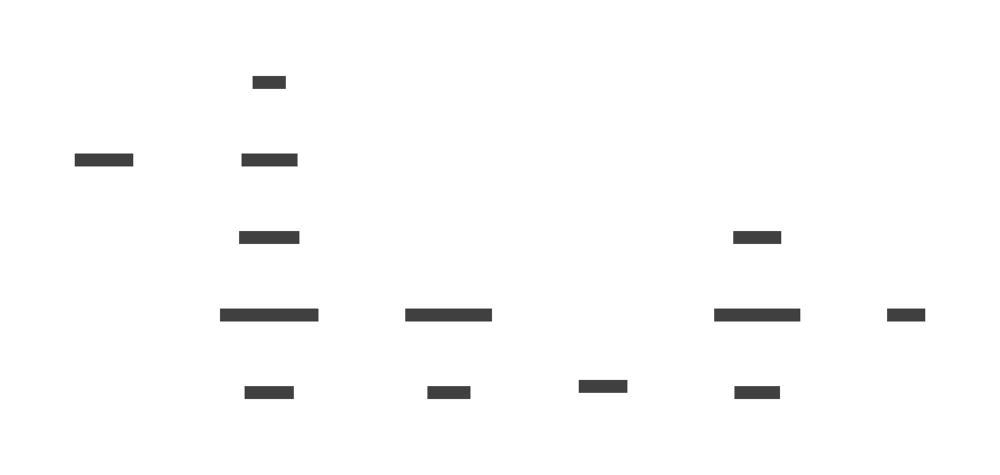

# 🗺️ Flux complet du projet

Ce schéma résume toutes les étapes principales, du clonage du dépôt à l'utilisation par le joueur.

1. **Clonage et installation** : `make install` installe les dépendances Python.
2. **Construction** : `docker compose build` prépare les images pour FastAPI et Ollama.
3. **Récupération des modèles** : lors du premier lancement, Ollama et Stable Diffusion téléchargent les fichiers nécessaires.
4. **Génération de la doc** : `mkdocs build` transforme les fichiers Markdown en site web.
5. **Exécution** : `docker compose up` démarre les services pour que Godot puisse interroger l'API.

## Voir aussi
- [Bootstrap](bootstrap.md)
- [MkDocs](mkdocs.md)
