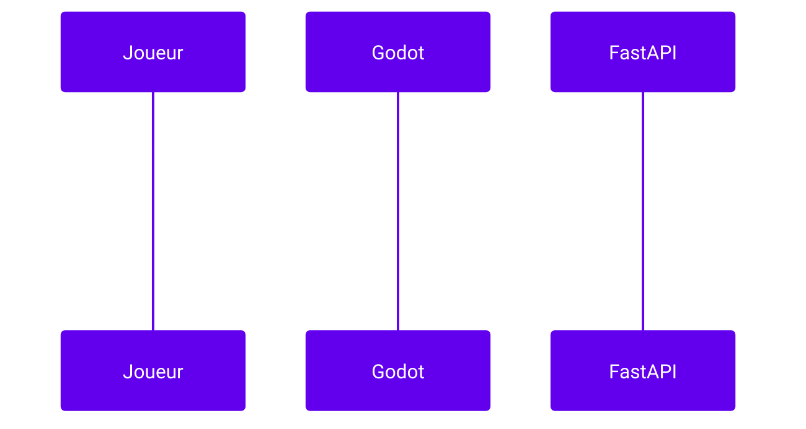

# 🎮 Godot

Godot est un moteur de jeu libre et léger. Dans ce projet, il fournit l'interface
graphique du mini-jeu et communique avec l'API Python.
Les scripts GDScript appellent l'endpoint `/generate-text` pour afficher les réponses du modèle.

Quand le joueur effectue une action, ces scripts envoient la requête à FastAPI
qui renvoie le texte généré par Ollama.



Pour lancer l'éditeur :
```bash
make run-godot
```

## Voir aussi

- [Utiliser l'API REST](../guides/utiliser-api.md)
- [Architecture globale](architecture.md)

## Ressources
- [Site officiel](https://godotengine.org/)
- [Documentation](https://docs.godotengine.org/en/stable/)
