# 🎮 Godot

Godot est un moteur de jeu libre et léger. Dans ce projet, il fournit l'interface
graphique du mini-jeu et communique avec l'API Python.
Les scripts GDScript appellent l'endpoint `/generate-text` pour afficher les réponses du modèle.

Quand le joueur effectue une action, ces scripts envoient la requête à FastAPI
qui renvoie le texte généré par Ollama.

```mermaid
sequenceDiagram
    participant P as Joueur
    participant G as Godot
    participant A as FastAPI
    P->>G: action
    G->>A: requête
    A-->>G: réponse
    G-->>P: affichage
```



Extrait de la fonction d'envoi d'un message au modèle :

```gdscript
func _send_to_llm(message: String):
    var url := "http://localhost:11434/api/generate"
    var body := {
        "model": "god:latest",
        "prompt": message,
        "stream": true
    }
    var headers := ["Content-Type: application/json"]
    var err := http.request(url, headers, HTTPClient.METHOD_POST, JSON.stringify(body))
    if err != OK:
        _append_message("Assistant", "[Erreur r\u00e9seau]")
```

Pour lancer l'éditeur :
```bash
make run-godot
```

## Voir aussi

- [Utiliser l'API REST](../guides/utiliser-api.md)
- [Architecture globale](architecture.md)

## Ressources
- [Site officiel](https://godotengine.org/)
- [Documentation](https://docs.godotengine.org/en/stable/)
