# 🎮 Godot

Godot est un moteur de jeu libre et léger. Dans ce projet, il fournit l'interface
graphique du mini-jeu et communique avec l'API Python.
Les scripts GDScript appellent l'endpoint `/generate-text` pour afficher les réponses du modèle.

Quand le joueur effectue une action, ces scripts envoient la requête à FastAPI
qui renvoie le texte généré par Ollama.

```mermaid
sequenceDiagram
    participant P as Joueur
    participant G as Godot
    participant A as FastAPI
    P->>G: action
    G->>A: requête
    A-->>G: réponse
    G-->>P: affichage
```



Pour lancer l'éditeur :
```bash
make run-godot
```

## Ressources
- [Site officiel](https://godotengine.org/)
- [Documentation](https://docs.godotengine.org/en/stable/)
