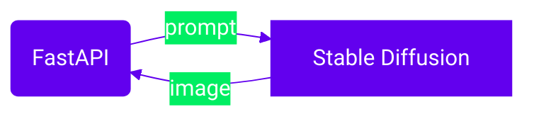

# 🎨 Stable Diffusion

Stable Diffusion est un modèle de génération d'images à partir d'une description textuelle.
Dans ce projet, il s'exécute dans un conteneur dédié.
Au premier `make up`, le conteneur télécharge automatiquement les poids du
modèle puis les conserve pour les exécutions suivantes.

L'image Docker embarque un script de démarrage qui vérifie si les fichiers sont
présents dans le volume `sd_models`. Si ce n'est pas le cas, ils sont
téléchargés avant que l'interface WebUI ne se lance.

FastAPI lui transmet vos invites afin d'illustrer certaines scènes du jeu.



Vous pouvez générer une image directement via l'API :
```bash
curl -X POST http://localhost:8000/generate-image \
  -H 'Content-Type: application/json' \
  -d '{"prompt": "un village médiéval"}' -o output.png
```

## Voir aussi

- [Configuration des services](../reference/docker-compose-yml.md)
- [Guide d'utilisation de l'API](../guides/utiliser-api.md)

## Ressources
- [Site officiel](https://stability.ai/)
- [Documentation](https://github.com/Stability-AI/stablediffusion)
